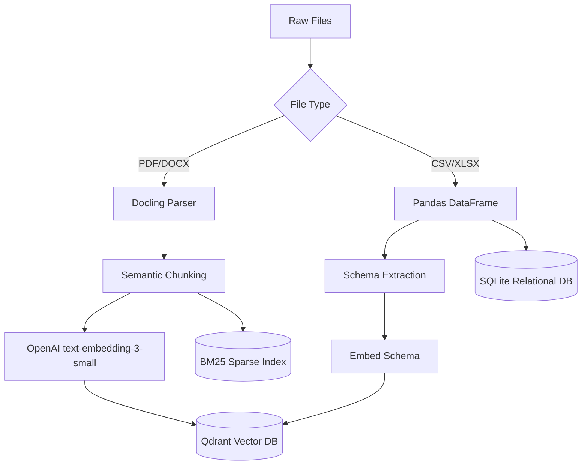
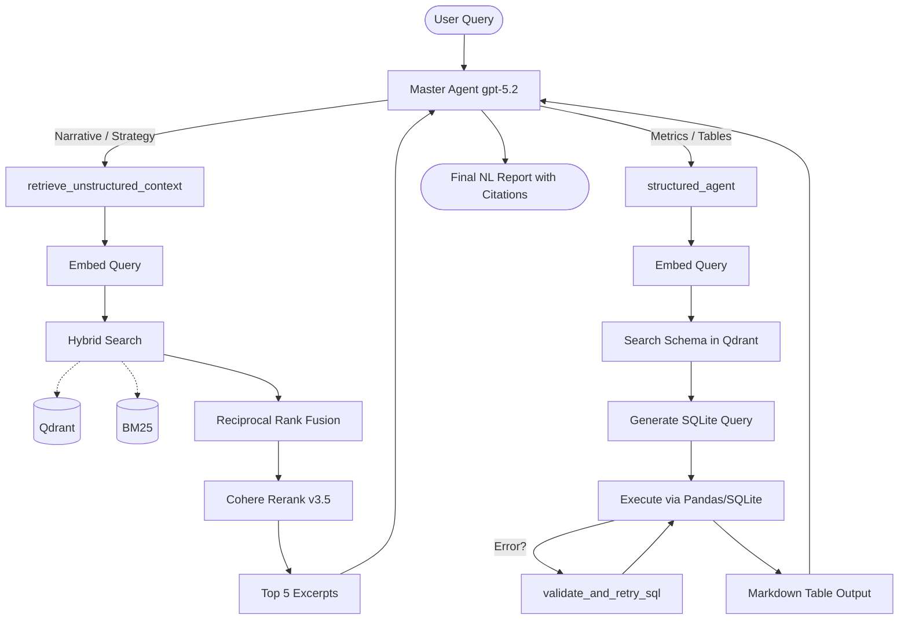

# Leadership Intelligence Agent 🤖

A high-performance RAG (Retrieval-Augmented Generation) agent built with **FastAPI**, **LangGraph**, and **LangCache**. It helps leadership teams extract insights from both unstructured documents (strategy/risk) and structured datasets (numeric KPIs).

---

## 🚀 Quick Start

### 1. Prerequisites
Ensure you have `uv` installed ([Install uv](https://docs.astral.sh/uv/getting-started/installation/)).

### 2. Setup Dependencies
```bash
uv sync
```

### 3. Environment Configuration
Create a `.env` file from the example:
```bash
cp .env.example .env
```

Fill in the following API keys and endpoints:

| Service | Environment Variable | Console Link |
| :--- | :--- | :--- |
| **OpenAI** | `OPENAI_API_KEY` | [platform.openai.com](https://platform.openai.com) |
| **Qdrant** | `QDRANT_API_KEY`, `QDRANT_CLUSTER_ENDPOINT` | [cloud.qdrant.io](https://cloud.qdrant.io) |
| **LangCache** | `LANGCACHE_API_KEY`, `LANGCACHE_SERVER_URL` | [langcache.redis.io](https://langcache.redis.io) |
| **Cohere** | `CO_API_KEY` | [dashboard.cohere.com](https://dashboard.cohere.com) |
| **Anthropic** | `ANTHROPIC_API_KEY` | [console.anthropic.com](https://console.anthropic.com) |

### 4. Run Development Server
```bash
npm run dev
```
*The API will be available at `http://localhost:8000`*

---

## 🛠 Tech Stack

- **Framework**: [FastAPI](https://fastapi.tiapi.com/)
- **Agent Orchestration**: [LangGraph](https://langchain-ai.github.io/langgraph/)
- **Semantic Caching**: [LangCache](https://redis.io/langcache/) (Ultra-fast Redis-based query caching)
- **Vector Database**: [Qdrant](https://qdrant.tech/) (Hybrid search: Dense + Sparse)
- **Metadata & Data Storage**: **SQLite** (Stores ingested file registry and structured queryable tables)
- **Reranking**: **Cohere Rerank v3.5** (Top-tier relevance sorting)

---

## 🏗 Architecture Diagrams

### 1. Ingestion Pipeline


### 2. Chat & Retrieval Pipeline


## 📂 Project Structure

- `app/agent/`: Core agent logic, prompts, and tools.
- `app/api/`: FastAPI routes for ingestion and chat.
- `app/db/`: Database connection handlers (SQLite, Qdrant, Redis).
- `app/ingest/`: Processors for unstructured (PDF/Docx) and structured (CSV/XLSX) data.
- `main.py`: Application entry point and lifespan management.

---

## 📝 Assignment Requirements & Implementation Verification

### 1. Model Configuration
The application accesses external models via environment variables. The codebase is currently configured to use:
- **LLM / Orchestration**: `gpt-5.2` (OpenAI) powers both the main reasoning agent and the SQL table-generation subagent.
- **Embeddings**: `text-embedding-3-small` (OpenAI) embeds text chunks (unstructured) and column definitions (structured schemas).
- **Reranker**: `rerank-v3.5` (Cohere) refines the top documents fetched during unstructured retrieval.

### 2. Implementation specifics
- **Unstructured Context Engine**: The agent uses hybrid retrieval (Qdrant for dense vectors + local BM25 for sparse keywords), merges them using Reciprocal Rank Fusion (RRF), applies Cohere reranking, and extracts the top 5 contextual excerpts.
- **Structured Data Engine**: The SQL agent maps natural language to database schemas using Qdrant semantic layout lookups. It safely queries the local SQLite DB using `pandas.read_sql_query()` and outputs metrics as markdown tables. Failed SQL queries invoke a self-correcting validation loop (`validate_and_retry_sql`).
- **Prompt Enforced Outputs**: The `MASTER_SYSTEM_PROMPT` strictly demands natural language reporting formatted with a 2-sentence executive summary, bullet points, and source citations (e.g., `[filename, page]`).

### 3. Running Sample Questions
The system processes natural language seamlessly and returns the required NL outputs. Provide your own `OPENAI_API_KEY` and `CO_API_KEY` in `.env`, run `npm run dev`, and input queries from the assignment directly into the chat:
- *"Why did revenue drop and what is the plan to recover?"* (Triggers parallel structured table math + unstructured strategy context)
- *"Return department names, actual vs target revenue, and variance for Q3 FY2024."* (Tests deep SQL aggregation/conversion)
- *"What is our risk and compliance approach?"* (Tests basic document retrieval)
